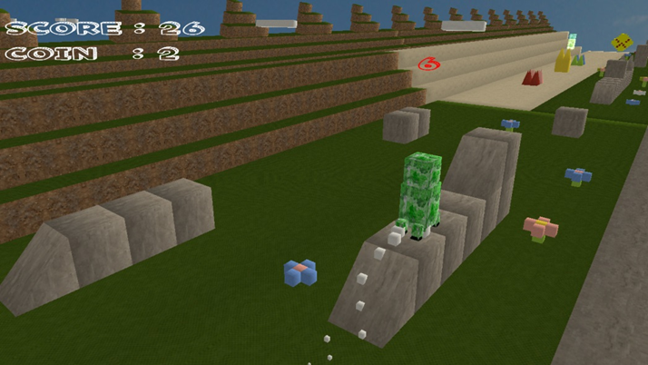
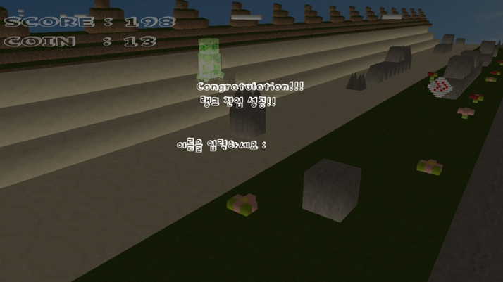
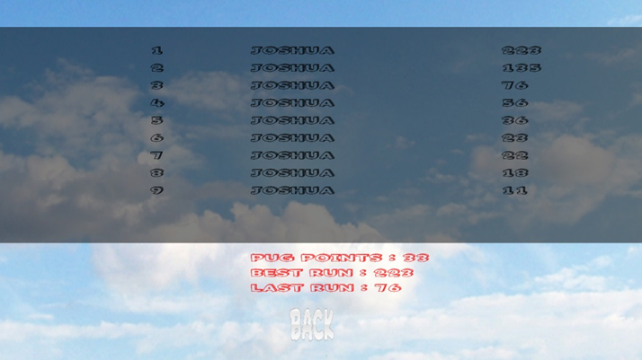
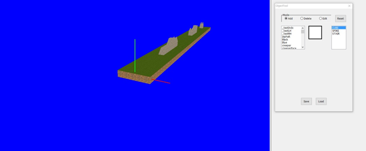
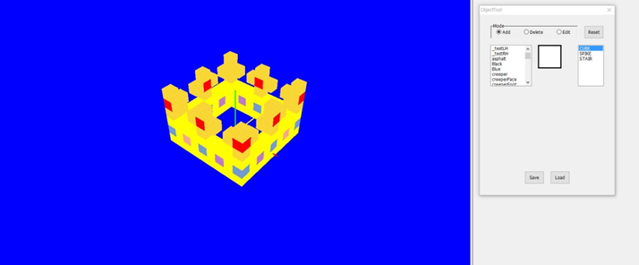
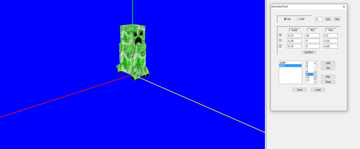
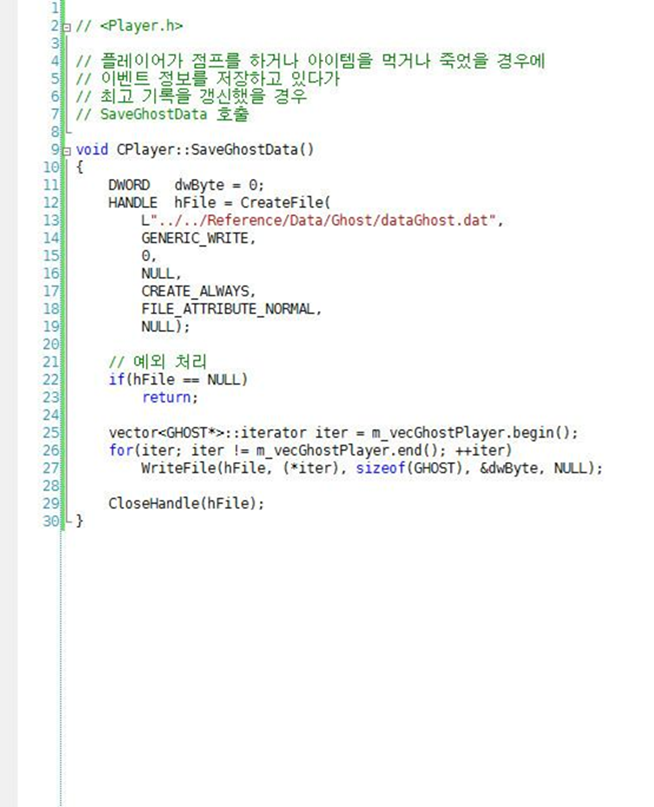
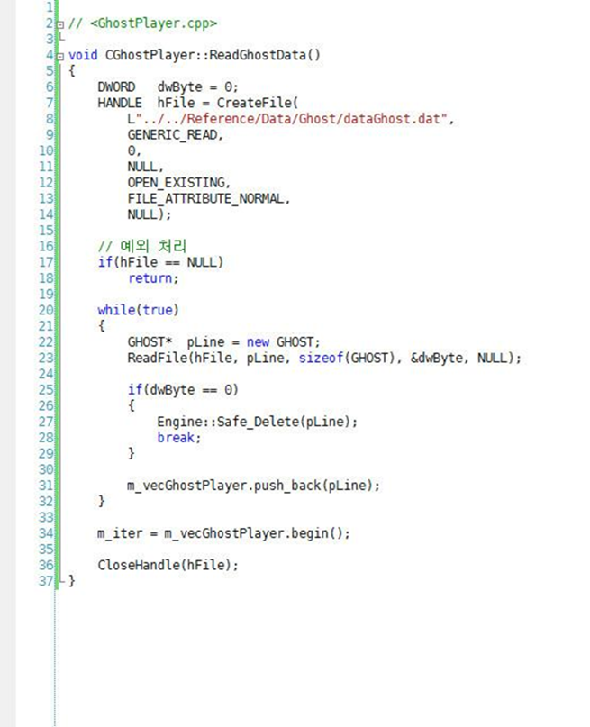

# Turbo Pug 3D 모작

## 시연 영상 및 게임 소개
 **← 클라이언트 시연 영상**  
 **← 툴 시연 영상**  

장애물을 피해 더 높은 점수를 기록하는 러닝 액션 게임

- MFC 를 이용한 오브젝트 툴 및 애니메이션 툴 구현
- 랭킹 시스템 및 고스트 기능 구현

## 핵심 기술

### MFC 를 이용한 오브젝트 툴 및 애니메이션 툴 구현
마우스 픽킹을 이용해 오브젝트 추가, 오브젝트 삭제, 텍스쳐 수정, 오브젝트 타입 수정, 오브젝트 크기/회전/위치 수정, 애니메이션 재생 기능 구현  
해당 툴을 활용해 맵, 장착 아이템, 게임 아이템, 애니메이션 제작  

### 랭킹 시스템 및 고스트 기능 구현
1위를 기록한 플레이 정보를 저장 후 재생하는 방식으로 대전 형식의 플레이 경험 제공  

## 담당 업무
| 이름 | 담당 |
|------|------|
| **문두르** | 메인 프로그램 / MFC 툴 |
| **이*미** | 오브젝트 / 이펙트 |
| **임*욱** | 플레이어 / UI |
| **오*수** | 고스트 플레이어 / 맵 |
